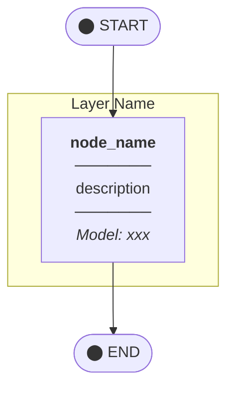
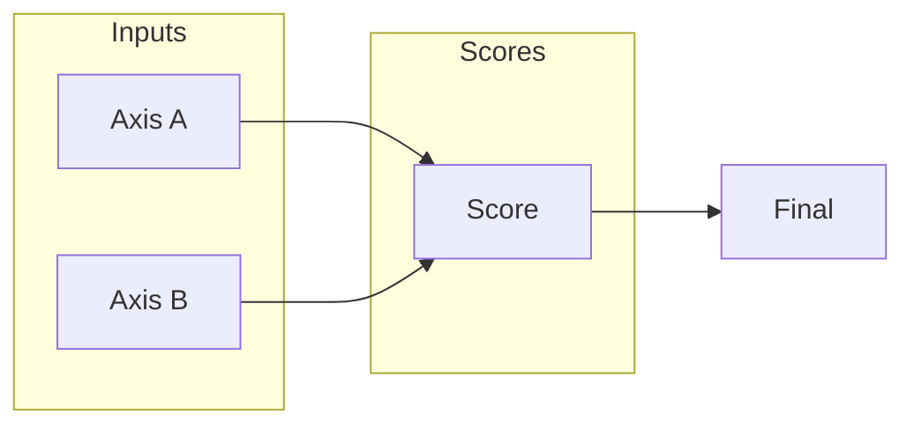
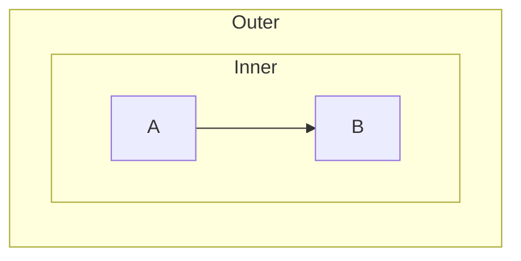

# Mermaid Diagrams

LangGraph-style Mermaid diagram authoring guide. Applies the mermaid.live editor palette.

## When to Use

- Producing architecture diagrams
- Visualizing flowcharts and StateGraphs
- Documenting system topology
- Visualizing LangGraph pipelines

## Color palette (LangGraph + mermaid.live style)

### Theme Variables

```javascript
%%{init: {
  'theme': 'default',
  'themeVariables': {
    'fontSize': '13px',
    'fontFamily': 'arial',
    'lineColor': '#6366F1',           // Indigo (connection lines)
    'primaryColor': '#dbeafe',        // Blue-100 (default node)
    'primaryBorderColor': '#3b82f6',  // Blue-500
    'primaryTextColor': '#1e293b',    // Slate-800
    'secondaryColor': '#fef3c7',      // Amber-100
    'secondaryBorderColor': '#f59e0b', // Amber-500
    'tertiaryColor': '#dcfce7',       // Green-100
    'tertiaryBorderColor': '#22c55e', // Green-500
    'clusterBkg': '#f8fafc',          // Slate-50 (subgraph background)
    'clusterBorder': '#cbd5e1'        // Slate-300
  }
}}%%
```

### Node class definitions

```css
%% ── Standard Node Styles ──
classDef startNode fill:#1e293b,stroke:#1e293b,color:#fff,font-weight:bold
classDef endNode fill:#1e293b,stroke:#1e293b,color:#fff,font-weight:bold
classDef codeNode fill:#f1f5f9,stroke:#64748b,color:#1e293b,stroke-width:2px
classDef plannerNode fill:#ede9fe,stroke:#7c3aed,color:#1e293b,stroke-width:2px
classDef gptNode fill:#fef3c7,stroke:#d97706,color:#1e293b,stroke-width:2px
classDef opusNode fill:#dbeafe,stroke:#2563eb,color:#1e293b,stroke-width:2px
classDef sonnetNode fill:#dcfce7,stroke:#16a34a,color:#1e293b,stroke-width:2px
classDef routeNode fill:#fef3c7,stroke:#d97706,color:#1e293b

%% ── Axis/Rubric Styles ──
classDef axisBlue fill:#dbeafe,stroke:#2563eb,color:#1e293b,stroke-width:2px
classDef axisGreen fill:#dcfce7,stroke:#16a34a,color:#1e293b,stroke-width:2px
classDef axisPurple fill:#ede9fe,stroke:#7c3aed,color:#1e293b,stroke-width:2px
classDef axisRed fill:#fee2e2,stroke:#dc2626,color:#1e293b,stroke-width:2px
classDef axisOrange fill:#ffedd5,stroke:#ea580c,color:#1e293b,stroke-width:2px
classDef axisYellow fill:#fef3c7,stroke:#d97706,color:#1e293b,stroke-width:2px
classDef axisCommunity fill:#fce7f3,stroke:#db2777,color:#1e293b,stroke-width:2px

%% ── Score/Output Styles ──
classDef scoreNode fill:#f1f5f9,stroke:#64748b,color:#1e293b,stroke-width:2px,font-weight:bold
classDef finalNode fill:#1e293b,stroke:#1e293b,color:#fff,font-weight:bold,stroke-width:3px

%% ── Tier Styles ──
classDef tierS fill:#dcfce7,stroke:#16a34a,color:#1e293b,stroke-width:2px,font-weight:bold
classDef tierA fill:#dbeafe,stroke:#2563eb,color:#1e293b,stroke-width:2px,font-weight:bold
classDef tierB fill:#fef3c7,stroke:#d97706,color:#1e293b,stroke-width:2px,font-weight:bold
classDef tierC fill:#fee2e2,stroke:#dc2626,color:#1e293b,stroke-width:2px,font-weight:bold

%% ── Cost Styles ──
classDef costLow fill:#dcfce7,stroke:#16a34a,color:#1e293b,stroke-width:1px,font-size:11px
classDef costMid fill:#fef3c7,stroke:#d97706,color:#1e293b,stroke-width:1px,font-size:11px
classDef costHigh fill:#fee2e2,stroke:#dc2626,color:#1e293b,stroke-width:1px,font-size:11px
```

## Color reference (Tailwind CSS)

| Purpose | Color | Hex | Tailwind |
|------|------|-----|----------|
| **Claude Opus** | Blue | `#dbeafe` / `#2563eb` | blue-100/500 |
| **Claude Sonnet** | Green | `#dcfce7` / `#16a34a` | green-100/600 |
| **GPT/Cortex** | Yellow | `#fef3c7` / `#d97706` | amber-100/600 |
| **Gemini** | Purple | `#ede9fe` / `#7c3aed` | violet-100/600 |
| **Code-based** | Gray | `#f1f5f9` / `#64748b` | slate-100/500 |
| **Error/High** | Red | `#fee2e2` / `#dc2626` | red-100/600 |
| **Community** | Pink | `#fce7f3` / `#db2777` | pink-100/600 |
| **Prospect** | Emerald | `#d1fae5` / `#059669` | emerald-100/600 |
| **Connection lines** | Indigo | `#6366F1` | indigo-500 |

## PNG generation

### Prerequisites

```bash
# Install mermaid-cli
npm install -g @mermaid-js/mermaid-cli
```

### Commands

```bash
# Single file
mmdc -i diagram.mmd -o diagram.png -s 2 -b transparent

# Batch conversion (every .mmd in a directory)
for f in *.mmd; do
  mmdc -i "$f" -o "${f%.mmd}.png" -s 2 -b transparent
done
```

### Options

| Option | Description | Recommended |
|------|------|--------|
| `-s` | Scale (resolution multiplier) | `2` (high resolution) |
| `-b` | Background | `transparent` or `white` |
| `-w` | Width (px) | auto |
| `-H` | Height (px) | auto |
| `-t` | Theme | `default` |
| `-c` | Config file | (optional) |

## Templates

### StateGraph Topology



### Scoring Flow (LR)



### Nested subgraph



## Recommended file layout

```
diagrams/
├── v5.5/                    # version-scoped folder
│   ├── main-topology.mmd    # main topology
│   ├── main-topology.png
│   ├── scoring-flow.mmd     # scoring flow
│   ├── scoring-flow.png
│   ├── rubric-system.mmd    # rubric system
│   └── rubric-system.png
└── legacy/                  # previous versions
```

## Checklists

When authoring an MMD:
- [ ] Include the `%%{init: ...}%%` theme block
- [ ] Apply `classDef` to every node
- [ ] Subgraph names: uppercase, descriptive
- [ ] Edge labels in `|"text"|` form
- [ ] Use `<b>`, `<i>`, `<br/>` HTML tags

When producing the PNG:
- [ ] Apply `-s 2` for high resolution
- [ ] `-b transparent` for transparent background
- [ ] Filenames match (`xxx.mmd` → `xxx.png`)
