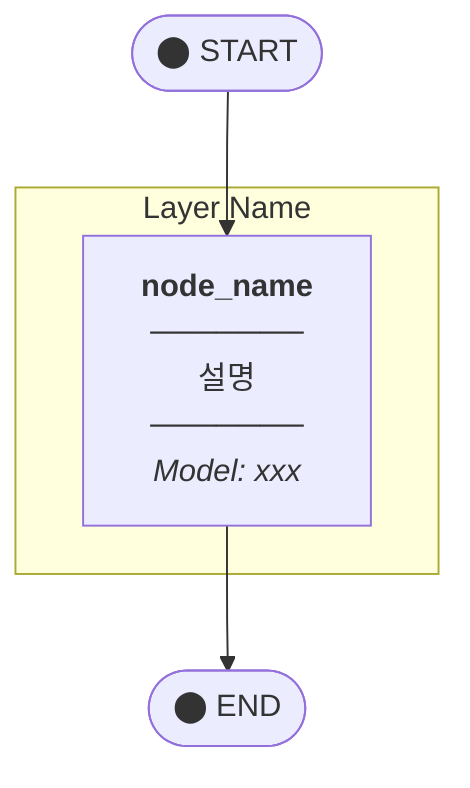
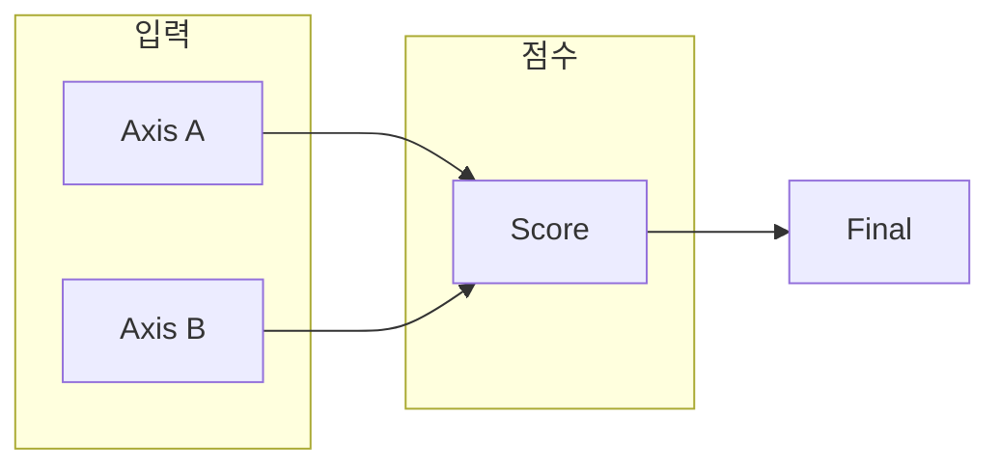
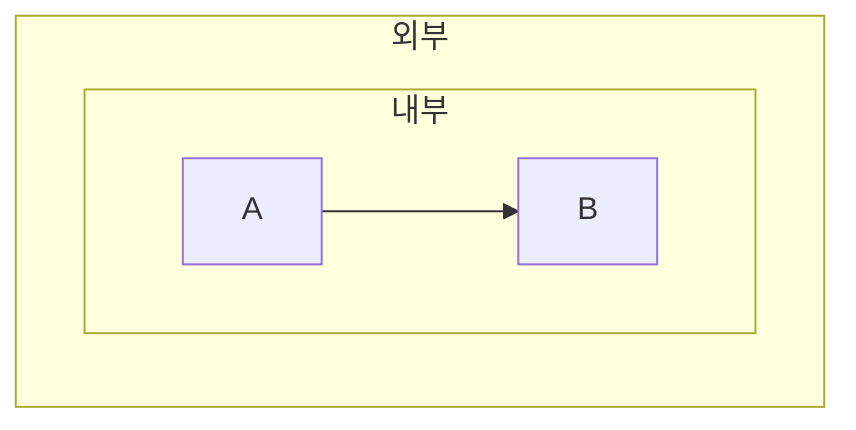

# Mermaid Diagrams

LangGraph 스타일 Mermaid 다이어그램 생성 가이드. mermaid.live 에디터 색감 적용.

## When to Use

- 아키텍처 다이어그램 생성
- 플로우차트, StateGraph 시각화
- 시스템 토폴로지 문서화
- LangGraph 파이프라인 시각화

## 색상 팔레트 (LangGraph + mermaid.live 스타일)

### Theme Variables

```javascript
%%{init: {
  'theme': 'default',
  'themeVariables': {
    'fontSize': '13px',
    'fontFamily': 'arial',
    'lineColor': '#6366F1',           // Indigo (연결선)
    'primaryColor': '#dbeafe',        // Blue-100 (기본 노드)
    'primaryBorderColor': '#3b82f6',  // Blue-500
    'primaryTextColor': '#1e293b',    // Slate-800
    'secondaryColor': '#fef3c7',      // Amber-100
    'secondaryBorderColor': '#f59e0b', // Amber-500
    'tertiaryColor': '#dcfce7',       // Green-100
    'tertiaryBorderColor': '#22c55e', // Green-500
    'clusterBkg': '#f8fafc',          // Slate-50 (subgraph 배경)
    'clusterBorder': '#cbd5e1'        // Slate-300
  }
}}%%
```

### Node Class 정의

```css
%% ── Standard Node Styles ──
classDef startNode fill:#1e293b,stroke:#1e293b,color:#fff,font-weight:bold
classDef endNode fill:#1e293b,stroke:#1e293b,color:#fff,font-weight:bold
classDef codeNode fill:#f1f5f9,stroke:#64748b,color:#1e293b,stroke-width:2px
classDef plannerNode fill:#ede9fe,stroke:#7c3aed,color:#1e293b,stroke-width:2px
classDef gptNode fill:#fef3c7,stroke:#d97706,color:#1e293b,stroke-width:2px
classDef opusNode fill:#dbeafe,stroke:#2563eb,color:#1e293b,stroke-width:2px
classDef sonnetNode fill:#dcfce7,stroke:#16a34a,color:#1e293b,stroke-width:2px
classDef routeNode fill:#fef3c7,stroke:#d97706,color:#1e293b

%% ── Axis/Rubric Styles ──
classDef axisBlue fill:#dbeafe,stroke:#2563eb,color:#1e293b,stroke-width:2px
classDef axisGreen fill:#dcfce7,stroke:#16a34a,color:#1e293b,stroke-width:2px
classDef axisPurple fill:#ede9fe,stroke:#7c3aed,color:#1e293b,stroke-width:2px
classDef axisRed fill:#fee2e2,stroke:#dc2626,color:#1e293b,stroke-width:2px
classDef axisOrange fill:#ffedd5,stroke:#ea580c,color:#1e293b,stroke-width:2px
classDef axisYellow fill:#fef3c7,stroke:#d97706,color:#1e293b,stroke-width:2px
classDef axisCommunity fill:#fce7f3,stroke:#db2777,color:#1e293b,stroke-width:2px

%% ── Score/Output Styles ──
classDef scoreNode fill:#f1f5f9,stroke:#64748b,color:#1e293b,stroke-width:2px,font-weight:bold
classDef finalNode fill:#1e293b,stroke:#1e293b,color:#fff,font-weight:bold,stroke-width:3px

%% ── Tier Styles ──
classDef tierS fill:#dcfce7,stroke:#16a34a,color:#1e293b,stroke-width:2px,font-weight:bold
classDef tierA fill:#dbeafe,stroke:#2563eb,color:#1e293b,stroke-width:2px,font-weight:bold
classDef tierB fill:#fef3c7,stroke:#d97706,color:#1e293b,stroke-width:2px,font-weight:bold
classDef tierC fill:#fee2e2,stroke:#dc2626,color:#1e293b,stroke-width:2px,font-weight:bold

%% ── Cost Styles ──
classDef costLow fill:#dcfce7,stroke:#16a34a,color:#1e293b,stroke-width:1px,font-size:11px
classDef costMid fill:#fef3c7,stroke:#d97706,color:#1e293b,stroke-width:1px,font-size:11px
classDef costHigh fill:#fee2e2,stroke:#dc2626,color:#1e293b,stroke-width:1px,font-size:11px
```

## 색상 참조 (Tailwind CSS)

| 용도 | 색상 | Hex | Tailwind |
|------|------|-----|----------|
| **Claude Opus** | 파란색 | `#dbeafe` / `#2563eb` | blue-100/500 |
| **Claude Sonnet** | 초록색 | `#dcfce7` / `#16a34a` | green-100/600 |
| **GPT/Cortex** | 노란색 | `#fef3c7` / `#d97706` | amber-100/600 |
| **Gemini** | 보라색 | `#ede9fe` / `#7c3aed` | violet-100/600 |
| **코드 기반** | 회색 | `#f1f5f9` / `#64748b` | slate-100/500 |
| **에러/High** | 빨간색 | `#fee2e2` / `#dc2626` | red-100/600 |
| **Community** | 핑크 | `#fce7f3` / `#db2777` | pink-100/600 |
| **Prospect** | 에메랄드 | `#d1fae5` / `#059669` | emerald-100/600 |
| **연결선** | 인디고 | `#6366F1` | indigo-500 |

## PNG 생성

### Prerequisites

```bash
# mermaid-cli 설치
npm install -g @mermaid-js/mermaid-cli
```

### 명령어

```bash
# 단일 파일
mmdc -i diagram.mmd -o diagram.png -s 2 -b transparent

# 배치 변환 (디렉토리 내 모든 .mmd)
for f in *.mmd; do
  mmdc -i "$f" -o "${f%.mmd}.png" -s 2 -b transparent
done
```

### 옵션

| 옵션 | 설명 | 권장값 |
|------|------|--------|
| `-s` | Scale (해상도 배수) | `2` (고해상도) |
| `-b` | Background | `transparent` 또는 `white` |
| `-w` | Width (px) | 자동 |
| `-H` | Height (px) | 자동 |
| `-t` | Theme | `default` |
| `-c` | Config file | (선택적) |

## 템플릿

### StateGraph Topology



### Scoring Flow (LR)



### Subgraph 중첩



## 파일 구조 권장

```
diagrams/
├── v5.5/                    # 버전별 폴더
│   ├── main-topology.mmd    # 메인 토폴로지
│   ├── main-topology.png
│   ├── scoring-flow.mmd     # 스코어링 플로우
│   ├── scoring-flow.png
│   ├── rubric-system.mmd    # 루브릭 체계
│   └── rubric-system.png
└── legacy/                  # 이전 버전
```

## 체크리스트

MMD 생성 시:
- [ ] `%%{init: ...}%%` 테마 설정 포함
- [ ] 모든 노드에 `classDef` 적용
- [ ] subgraph 이름은 대문자 + 설명적
- [ ] 연결선 라벨은 `|"텍스트"|` 형식
- [ ] `<b>`, `<i>`, `<br/>` HTML 태그 활용

PNG 생성 시:
- [ ] `-s 2` 고해상도 적용
- [ ] `-b transparent` 배경 투명
- [ ] 파일명 일치 (`xxx.mmd` → `xxx.png`)
