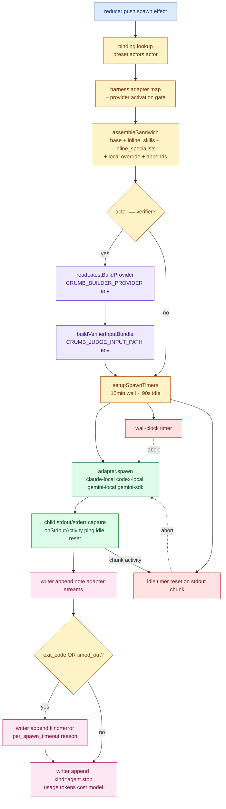
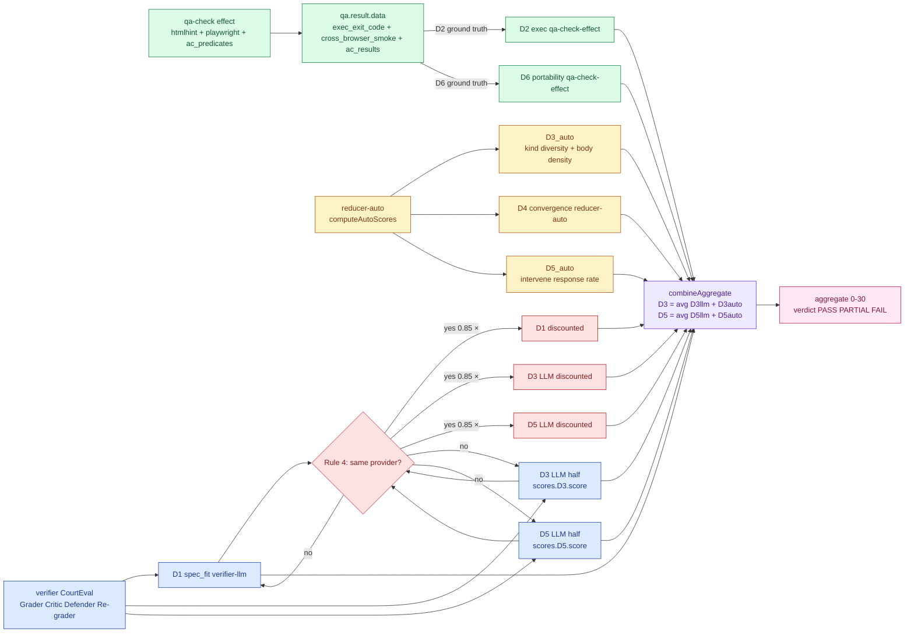
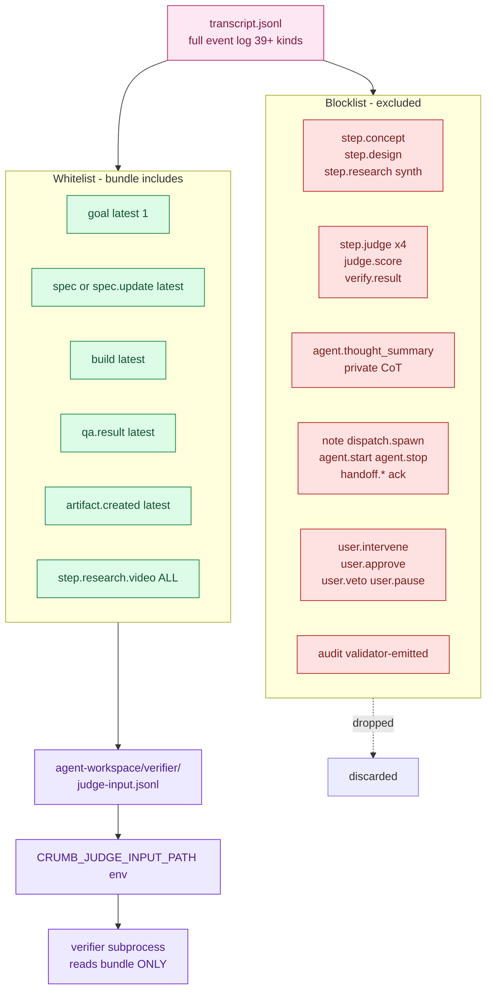
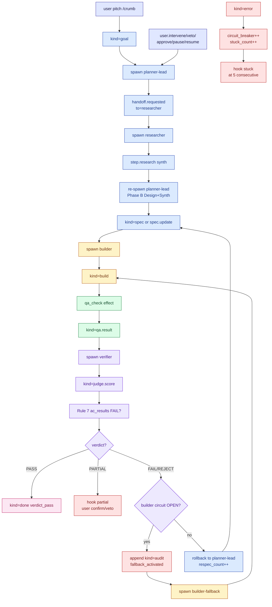
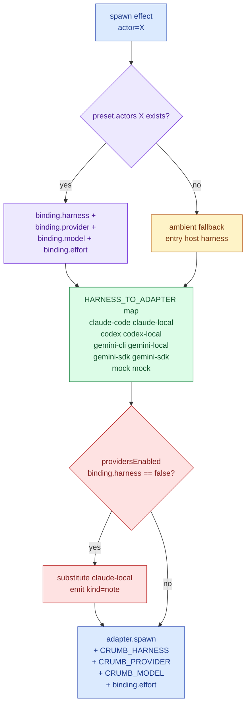

# Crumb v3.5 시스템 다이어그램

> 6 Mermaid 다이어그램. 텍스트 spec 은 [[bagelcode-system-architecture-v3.5]].
> 색상 — Tailwind CSS 기반 (Claude Code `mermaid-diagrams` skill 가이드 참조).

---

## 1. Spawn lifecycle — sandwich → adapter → timer race → emit

dispatcher 가 reducer 의 `effect{type:'spawn'}` 을 받아 actor subprocess 를 띄우는 전체 lifecycle. verifier 의 추가 분기 (judge-input bundle prepare) 가 강조됨.

---

## 2. Score path — D1-D6 source-of-truth + 3-layer combine

verifier emit → reducer/validator → final aggregate 의 dim-by-dim provenance. Rule 4 numerical discount 가 LLM half (D1/D3/D5) 만 깎는 위치가 명확.

---

## 3. Anti-deception waterfall — 7 rules

`checkAntiDeception` 의 순차 실행. 마지막 단계의 verdict downgrade 까지.

```mermaid
flowchart TD
    classDef rule fill:#fef3c7,stroke:#b45309,color:#78350f
    classDef force fill:#fee2e2,stroke:#b91c1c,color:#7f1d1d
    classDef pass fill:#dcfce7,stroke:#15803d,color:#14532d
    classDef verdict fill:#ede9fe,stroke:#6d28d9,color:#4c1d95

    IN[judge.score event<br/>+ qaResult + autoScores + builderProvider]:::pass
    R1{R1: PASS &amp; exec_exit_code != 0?}:::rule
    R1Y[force D2=0<br/>verdict=FAIL<br/>tag verify_pass_without_exec_zero]:::force
    R2{R2: D2 != ground truth?}:::rule
    R2Y[force D2 to expected<br/>tag verifier_overrode_d2_ground_truth]:::force
    R3{R3: D4 != autoScores.D4?}:::rule
    R3Y[force D4 to autoScores<br/>tag verifier_overrode_d4_ground_truth]:::force
    R4{R4: same-provider?}:::rule
    R4Y[D1*0.85 D3*0.85 D5*0.85<br/>tags self_bias_risk_same_provider<br/>+ self_bias_score_discounted]:::force
    R5{R5: video evidence + D5 high + no citation?}:::rule
    R5Y[force D5=0<br/>tag researcher_video_evidence_missing]:::force
    AGG[combineAggregate recompute<br/>aggregate threshold check]:::pass
    F[aggregate < 24 floor downgrade?]:::rule
    FY[verdict→PARTIAL]:::verdict
    R6{R6: PASS but D1<3 AND D5<3?}:::rule
    R6Y[verdict→PARTIAL<br/>tag composite_gaming_d1_d5_below_minimum]:::force
    R7{R7 v3.5: PASS but ac_results FAIL?}:::rule
    R7Y[D1 cap 2<br/>verdict→PARTIAL<br/>tag verify_pass_with_ac_failure]:::force
    OUT[final scores + violations<br/>kind=audit emit if any]:::verdict

    IN --> R1
    R1 -- yes --> R1Y --> R2
    R1 -- no --> R2
    R2 -- yes --> R2Y --> R3
    R2 -- no --> R3
    R3 -- yes --> R3Y --> R4
    R3 -- no --> R4
    R4 -- yes --> R4Y --> R5
    R4 -- no --> R5
    R5 -- yes --> R5Y --> AGG
    R5 -- no --> AGG
    AGG --> F
    F -- yes --> FY --> R6
    F -- no --> R6
    R6 -- yes --> R6Y --> R7
    R6 -- no --> R7
    R7 -- yes --> R7Y --> OUT
    R7 -- no --> OUT
```

---

## 4. Verifier judge-input bundle projection — file-level isolation

dispatcher 가 verifier spawn 직전 `transcript.jsonl` → `judge-input.jsonl` 로 projection 하는 whitelist / blocklist matrix.

근거 frontier:
- ComplexEval Bench EMNLP 2025 §805 — auxiliary information bias scales with task complexity
- Preference Leakage ICLR 2026 — same-family generator reasoning inflates judge scores
- Anthropic Hybrid Norm 2026 — prompt-only mitigation 50%, file-level isolation = 잔여 50%

---

## 5. Routing matrix — kind → next_speaker / done / hook

reducer 의 18-case switch 를 단일 그래프로. event 가 들어왔을 때 어떤 effect 가 발화하는지.

---

## 6. Preset binding resolution — (harness × provider × model) tuple

dispatch 가 actor → adapter 를 결정하는 fallback chain.

5 presets:
- **bagelcode-cross-3way** ★ default — builder=codex, verifier=gemini-cli, rest=ambient
- **solo** — single-host (Claude only); R4 self-bias 의 경고 표시
- **sdk-enterprise** — API key direct (coordinator/planner/builder-fallback=anthropic-sdk, builder=openai-sdk, verifier=google-sdk)
- **mock** — deterministic CI / no auth
- **bagelcode-video-research** — researcher=gemini-sdk 명시 (video evidence path)

---

## See also

- [[bagelcode-system-architecture-v3.5]] — text spec (이 페이지의 짝)
- [[bagelcode-system-architecture-v3]] — v3 baseline 다이어그램 6 종 (orchestration topology / handoff / scoring layers / etc.)
- [[bagelcode-orchestration-topology]] — Hub-Ledger-Spoke 도형
- [[bagelcode-fault-tolerance-design]] — F1-F5 fault matrix (Rule 7 이 F2 verdict-without-evidence 보강)
- `~/.claude/skills/mermaid-diagrams/SKILL.md` — Tailwind 색감 가이드 (Claude Code skill)
