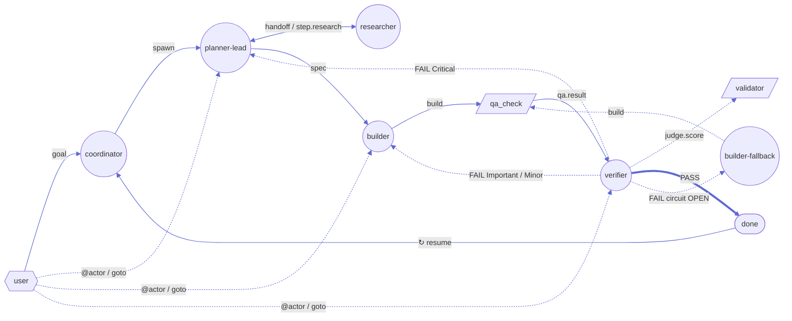

# Crumb pipeline — v0.4.2 canonical diagram

> Single source of truth for the post-PR-G control flow. Mermaid source at
> `wiki/diagrams/pipeline-v0.4.mmd` — render via `mermaid.live` editor or any
> Mermaid 11+ renderer. Studio's live DAG (`packages/studio/src/client/studio.js`
> §`DAG_NODES` + `DAG_EDGES`) mirrors this exactly.

## Diagram

## Routing rules (cited)

| Trigger | Reducer code | Outcome |
|---|---|---|
| `goal` | `src/reducer/index.ts case 'goal'` | spawn `planner-lead`, prompt = goal body |
| `handoff.requested` `to=researcher` | reducer routes by `payload.to` | spawn `researcher` |
| `step.research` | reducer | spawn `planner-lead` (Phase B re-entry) |
| `spec` | reducer | spawn `builder` |
| `build` | reducer | `qa_check` effect (deterministic, no LLM) |
| `qa.result` | reducer | spawn `verifier` |
| `judge.score` PASS | reducer | `done(verdict_pass)` |
| `judge.score` PARTIAL | reducer | hook `user_modal_required` |
| `judge.score` FAIL + circuit OPEN | reducer | spawn `builder-fallback` (different LLM) |
| `judge.score` FAIL + `deviation.type=Critical` | **PR-G2** | rollback to `planner-lead` (full respec) |
| `judge.score` FAIL + `deviation.type=Important/Minor` (default) | **PR-G2** | respawn `builder` w/ `suggested_change` as one-shot `sandwich_append` |
| `handoff.rollback` (verifier-emitted) | **PR-G2** | same deviation-typed routing as FAIL path |
| `judge.score` violations | `validator/anti-deception.ts` | append `from='validator', kind='audit'` + sanitize scores |
| `user.intervene` `goto:X` | reducer | spawn X with body as prompt |
| `user.intervene` `target_actor:X, body` (no goto) | **PR-G7-A** | spawn X with body as prompt (`@<actor>` shorthand) |
| `user.intervene` on `state.done` | **PR-G7-C** | clear `done`, reduce, spawn |
| `crumb resume <id> --run` / Studio `↻` | **PR-G7-B** | re-enter `runSession()` (with `--force` for budget-exhausted) |

## Five lifecycle phases (matches studio columns)

| Phase | Actors / effects | Purpose |
|---|---|---|
| **A · Spec** | `planner-lead`, `researcher` | Socratic + Concept + Design + Synth → `kind=spec` + `artifacts/{spec.md, DESIGN.md, tuning.json}` |
| **B · Build** | `builder`, `builder-fallback` | Multi-file PWA emit under `artifacts/game/**` → `kind=build` |
| **C · QA** | `qa_check` effect | Deterministic ground truth — htmlhint + Playwright + AC predicates → `kind=qa.result` (D2/D6) |
| **D · Verify** | `verifier` (CourtEval), `validator` (anti-deception code module) | LLM judge (`judge.score`) + reducer-side validator emits `from='validator', kind='audit'` |
| **E · Done** | `done` terminal | Verdict-based exit. Resume cycle goes back to `coordinator` |

## Three node shapes (semantic)

| Shape | Meaning | Examples |
|---|---|---|
| circle | LLM-driven actor (spawns subprocess) | coordinator, planner-lead, researcher, builder, builder-fallback, verifier |
| hexagon | deterministic effect (no LLM) | qa_check, validator |
| diamond | external input | user |
| rounded box (dashed) | terminal | done |

## Eight edge types (semantic)

| Edge | Color / stroke | When |
|---|---|---|
| `flow` | indigo solid | standard handoff / spawn |
| `respawn` | blue dashed | Important/Minor deviation → rebuild same actor (PR-G2) |
| `rollback` | amber dashed | Critical deviation → planner-lead respec |
| `fallback` | red dashed | circuit OPEN → builder-fallback (different LLM) |
| `terminal` | green solid | verifier PASS → done |
| `audit` | pink dotted | anti-deception side-effect (conditional) |
| `intervene` | gray dotted | user.intervene goto / @actor shorthand (PR-G7-A) |
| `resume` | cyan solid | done → re-enter loop (PR-G7-B) |

## Why the verifier has THREE feedback edges (not one)

Pre-PR-G the verifier always rolled back to planner. Post-PR-G the routing is
`deviation.type`-typed:

- **Critical** (spec contradicts itself, AC impossible): full respec via
  planner. Burns a planner cycle.
- **Important/Minor** (build needs a tightly-scoped fix, e.g. "1-line entry
  redirector"): respawn the original `builder` with `suggested_change` injected
  as a one-shot `sandwich_append`. Avoids a plan-cycle. Default when
  `deviation.type` is omitted.
- **circuit OPEN** (builder LLM crashed 3× in a row): infrastructure failure,
  swap to `builder-fallback` (different LLM). Independent of `deviation.type`.

This is the single most important architectural delta vs the v0.3 pipeline.
The studio DAG renders all three with distinct colors so the live trace is
unambiguous.
